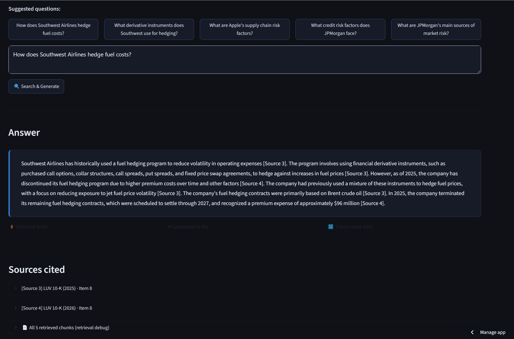
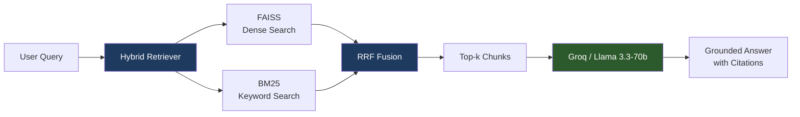

# 📊 Financial Research Assistant

> AI-powered research over SEC filings and earnings calls — ask questions, get cited answers grounded in real documents.

**[🚀 Live Demo](https://finance-rag-research-assistant-5yj696qk6dltquznzsiv8n.streamlit.app/)**



---

## What it does

This is a domain-specific RAG (Retrieval-Augmented Generation) system built over financial documents. You ask a question in plain English — the system retrieves the most relevant passages from SEC 10-K filings and earnings call transcripts, then generates a grounded answer with citations back to the source document and section.

No hallucination. If the answer isn't in the corpus, it says so.

---

## Architecture



### Why hybrid retrieval?

Most RAG tutorials use dense vector search (FAISS) alone. Finance text breaks this:

- **Dense search** finds semantically similar passages but misses exact numbers and tickers — "4.1B", "LUV", "SOFR" all need exact matches
- **BM25 keyword search** catches exact terms but misses paraphrases ("net income" vs "earnings")
- **Reciprocal Rank Fusion (RRF)** merges both ranked lists without needing to calibrate score scales — chunk 0 scored by both methods rises to the top

### Why structure-aware chunking?

Generic 500-token fixed-size chunking fails on financial documents:

- **10-K financial tables** (balance sheets, income statements) get sliced mid-row, destroying the data
- **Earnings call transcripts** have speaker turns — a Q&A pair split across two chunks loses the context of who asked what

This project chunks 10-Ks by SEC Item section (Item 1A, Item 7, Item 8...) and detects table boundaries to keep them intact. Transcripts are chunked by speaker turn, grouping analyst questions with executive responses.

---

## Tech Stack

| Component | Technology | Why |
|-----------|-----------|-----|
| Embeddings | `sentence-transformers/all-MiniLM-L6-v2` | Fast, 384-dim, strong semantic similarity |
| Vector store | `faiss-cpu` (IndexFlatIP) | Exact cosine search, no approximation error at this scale |
| Keyword search | `rank-bm25` (BM25Okapi) | Finance-tuned tokenizer preserves `$`, `%`, ticker symbols |
| Fusion | Reciprocal Rank Fusion | Scale-agnostic merge of dense + sparse rankings |
| Generation | `llama-3.3-70b-versatile` via Groq | Fast inference, strong instruction following, free tier |
| Frontend | Streamlit | Rapid deployment, clean for demos |
| HTML parsing | BeautifulSoup + lxml | iXBRL-aware: strips hidden XBRL metadata before text extraction |

---

## Corpus

| Company | Documents | Chunks |
|---------|-----------|--------|
| JPMorgan Chase (JPM) | 10-K FY2025, Q1 2026 Earnings Call | 667 |
| Apple Inc. (AAPL) | 10-K FY2024, FY2025 | 223 |
| Southwest Airlines (LUV) | 10-K FY2025, FY2026 | 507 |
| **Total** | **6 documents** | **1,397 chunks** |

All documents sourced from [SEC EDGAR](https://www.sec.gov/cgi-bin/browse-edgar) (public domain). Extensible to any public company via the included download script.

---

## Project Structure

```
finance-rag-research-assistant/
├── app.py                  # Streamlit frontend
├── src/
│   ├── chunker.py          # Structure-aware HTML → chunks pipeline
│   ├── retriever.py        # FAISS + BM25 + RRF hybrid retrieval
│   └── generator.py        # Groq/Llama3 grounded generation
├── scripts/
│   └── download_corpus.py  # SEC EDGAR API downloader
├── data/
│   ├── raw/                # Source HTML files (not committed — large)
│   ├── chunks/             # Processed JSON chunks
│   └── index/              # FAISS + BM25 indexes
└── requirements.txt
```

---

## Running locally

```bash
# 1. Clone and install
git clone https://github.com/ArshiaGarg11/finance-rag-research-assistant.git
cd finance-rag-research-assistant
pip install -r requirements.txt

# 2. Set your Groq API key (free at console.groq.com)
# Windows:
$env:GROQ_API_KEY="your_key_here"
# Mac/Linux:
export GROQ_API_KEY="your_key_here"

# 3. Download source documents (optional — indexes already included)
python scripts/download_corpus.py

# 4. Rebuild indexes (optional — pre-built indexes already in repo)
python src/chunker.py
python src/retriever.py

# 5. Run the app
streamlit run app.py
```

---

## Key design decisions

**Domain specificity over generality**: A general "chat with any PDF" system is table-stakes in 2025. Targeting finance specifically means the chunking handles financial tables correctly, the BM25 tokenizer preserves financial symbols, and every design decision can be justified by the domain's requirements.

**iXBRL handling**: SEC EDGAR filings since 2020 use inline XBRL, which embeds thousands of hidden metadata tags in the HTML. A naive `soup.get_text()` returns 30% garbage (XBRL tag content). This project strips `<ix:header>` blocks and `display:none` elements before extraction.

**Citation forcing**: The system prompt explicitly forbids the model from answering outside the provided context and requires `[Source N]` citations on every factual claim. This makes hallucination detectable and auditable.

**Evaluation**: Retrieval quality measured with precision@k on a manually curated 25-question evaluation set covering all three companies and both document types.

---

## Sample outputs

**Q: How does Southwest Airlines hedge fuel costs?**

> Southwest uses financial derivative instruments, such as purchased call options, collar structures, call spreads, put spreads, and fixed price swap agreements, to hedge against fuel price volatility [Source 3]. The company's hedge positions are based on commodities such as West Texas Intermediate ("WTI") crude oil, Brent crude oil, and refined products [Source 3]. As of December 31, 2024, the company has fuel derivative contracts in place through 2027, with 47% hedged in 2025, 43% in 2026, and 13% in 2027 [Source 4].

**Q: What are Apple's main supply chain risks?**

> Apple faces risks of supply interruption from natural disasters, industrial accidents, cybersecurity attacks, and labor disputes affecting both its own facilities and those of suppliers [Source 2]. The company's reliance on single or limited sources for critical components amplifies the impact of any disruption [Source 2]. Supply shortages and price increases can also result from industry consolidation or suppliers prioritizing common components over Apple-specific ones [Source 4].

---

